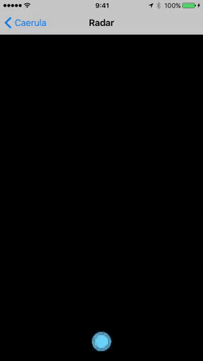

# Caerula

Beacon radar view for UIKit

Scan iBeacon accessories and visualize in a view with UIKit dynamics animation.

[](https://travis-ci.org/banjun/Caerula)
[](http://cocoapods.org/pods/Caerula)
[](http://cocoapods.org/pods/Caerula)
[](http://cocoapods.org/pods/Caerula)

## Example



To run the example project, clone the repo, and run `pod install` from the Example directory first.

## Requirements

## Installation

Caerula is available through [CocoaPods](http://cocoapods.org). To install
it, simply add the following line to your Podfile:

```ruby
pod "Caerula"
```

## Author

banjun

## License

Caerula is available under the MIT license. See the LICENSE file for more info.
